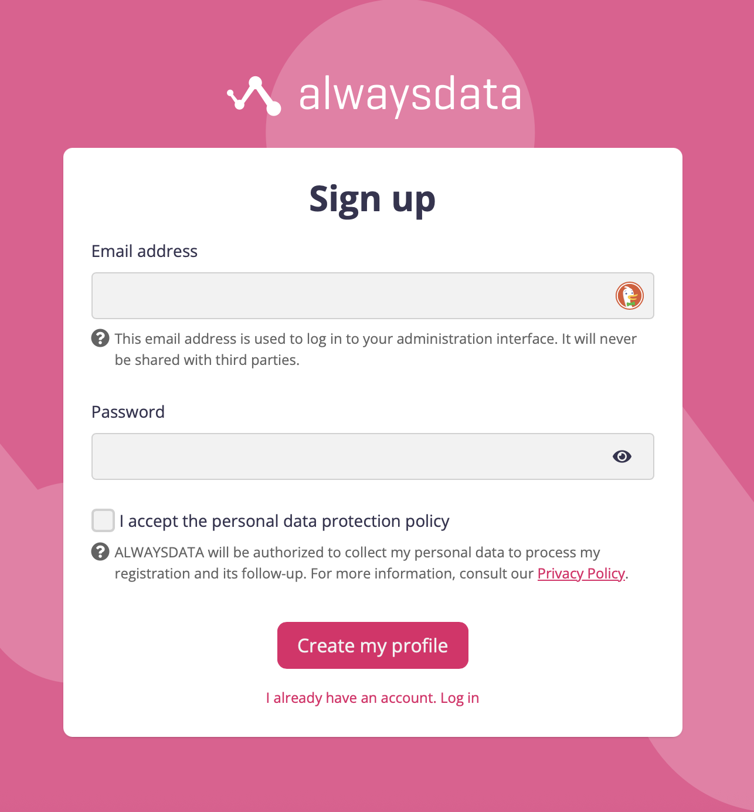
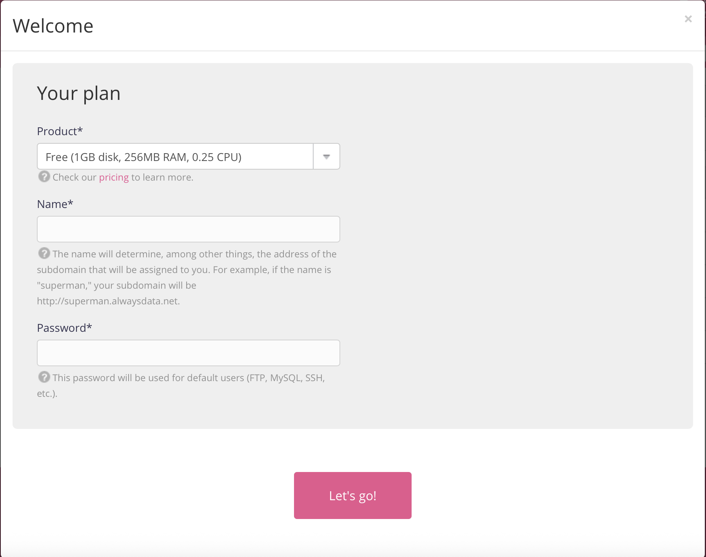
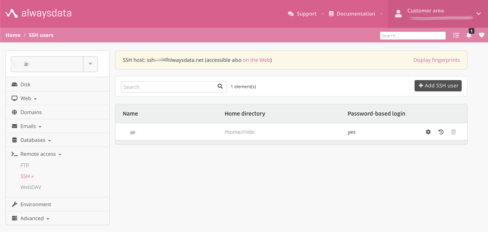
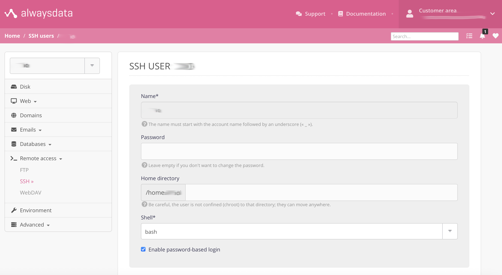
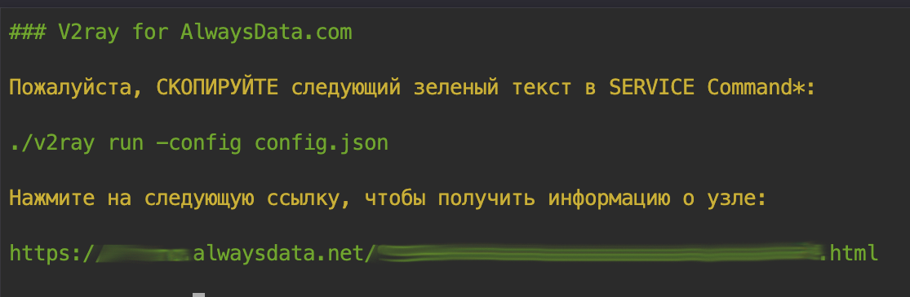
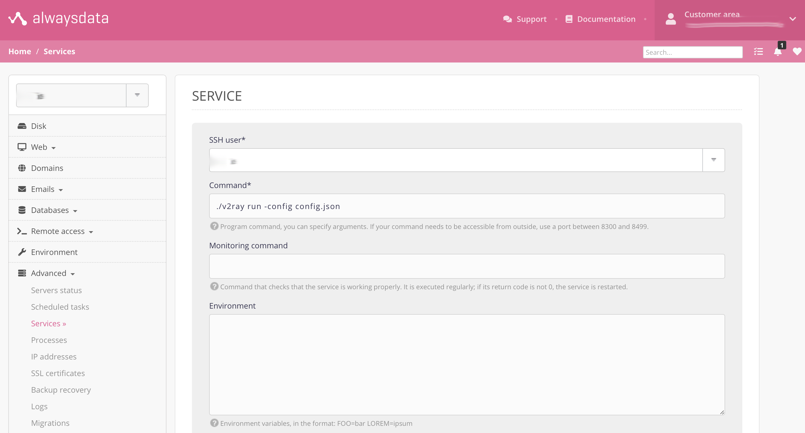
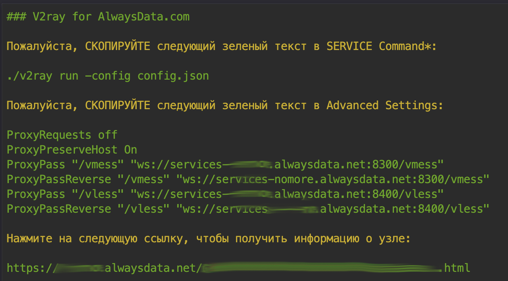

# Создание бесплатного высокоскоростного v2ray узла с помощью Alwaysdata.com

## 1. Введение в Alwaysdata.com

Alwaysdata — это французский провайдер виртуального хостинга, который предоставляет не только платный, но и бесплатный виртуальный хостинг. Сервис поддерживает динамические программы PHP5, CGI (Perl5), Python, Ruby, позволяет создавать неограниченное количество баз данных MySQL, PostgreSQL, управлять файлами через FTP и веб-интерфейс, а также предоставляет права SSH и WebDAV. 

**Главное: с помощью Alwaysdata также можно развернуть узел v2ray**.

**Официальная документация Alwaysdata:** [https://help.alwaysdata.com/en/](https://help.alwaysdata.com/en/)

## 2. Важные замечания

Для любой облачной платформы разработки проекты майнинга и прокси-трафика нежелательны и считаются злоупотреблением. Рекомендуется использовать Alwaysdata в качестве резервного канала связи, риски блокировки аккаунта и другие последствия несете Вы сами.

## 3. Регистрация и вход в Alwaysdata.com

Регистрация на Alwaysdata.com очень простая — нужен только email адрес.

**Официальный адрес:** [https://www.alwaysdata.com/en/register/](https://www.alwaysdata.com/en/register/)



## 4. Настройка узла v2ray

### Шаг 1
После входа в Alwaysdata появится следующее окно. Создайте аккаунт согласно изображению ниже. Если в процессе создания система выдаст сообщение "This name is not valid. Please choose another one.", это означает, что введенное вами имя уже занято, пожалуйста, выберите другое. Введенные здесь Name и password являются именем пользователя и паролем для входа в SSH и FTP.



### Шаг 2
Нажмите левое меню Remote access -> SSH. Проверьте, что включен Password-based login. Если нет - нажмите кнопку шестеренки и поставьте галочку.



### Шаг 3
Нажмите (accessible also on the Web) и войдите в аккаунт. Выполните следующую команду для установки v2ray:

```bash
bash <(curl -sL https://raw.githubusercontent.com/gglluukk/V2ray-for-AlwaysData/main/install.sh)
```



### Шаг 4
После выполнения команды на предыдущем шаге появится следующее сообщение:



### Шаг 5
Согласно подсказке настройте Services. Сначала нажмите левое меню Advanced -> Services, затем нажмите кнопку Add a service справа. Как показано на рисунке, скопируйте следующую команду в Command*, затем нажмите кнопку Submit внизу.

```
./v2ray -config config.json
```



### Шаг 6
Снова нажмите левое меню Web -> Sites, затем нажмите значок перезапуска.



### Шаг 7
Откройте URL, созданный программой на шаге 4, чтобы получить ссылки узлов vmess/vless и QR-коды. Импортируйте ссылки узлов в v2rayN или отсканируйте предоставленный QR-код мобильным телефоном для подключения v2ray.
